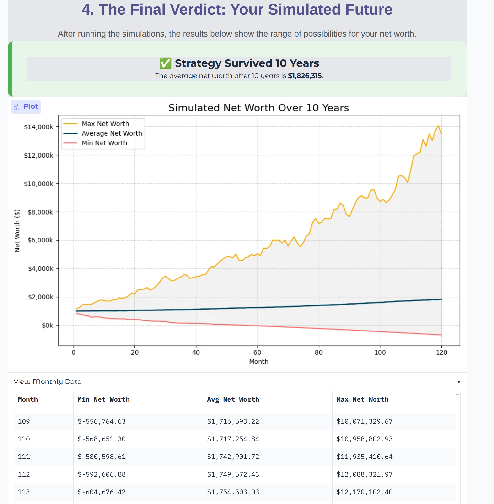
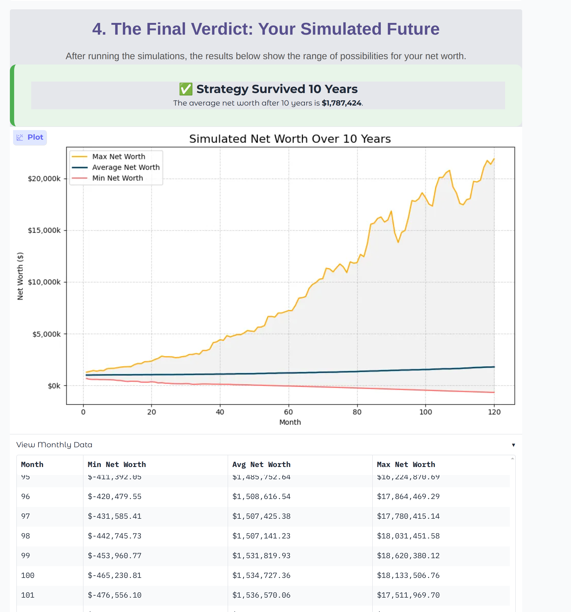
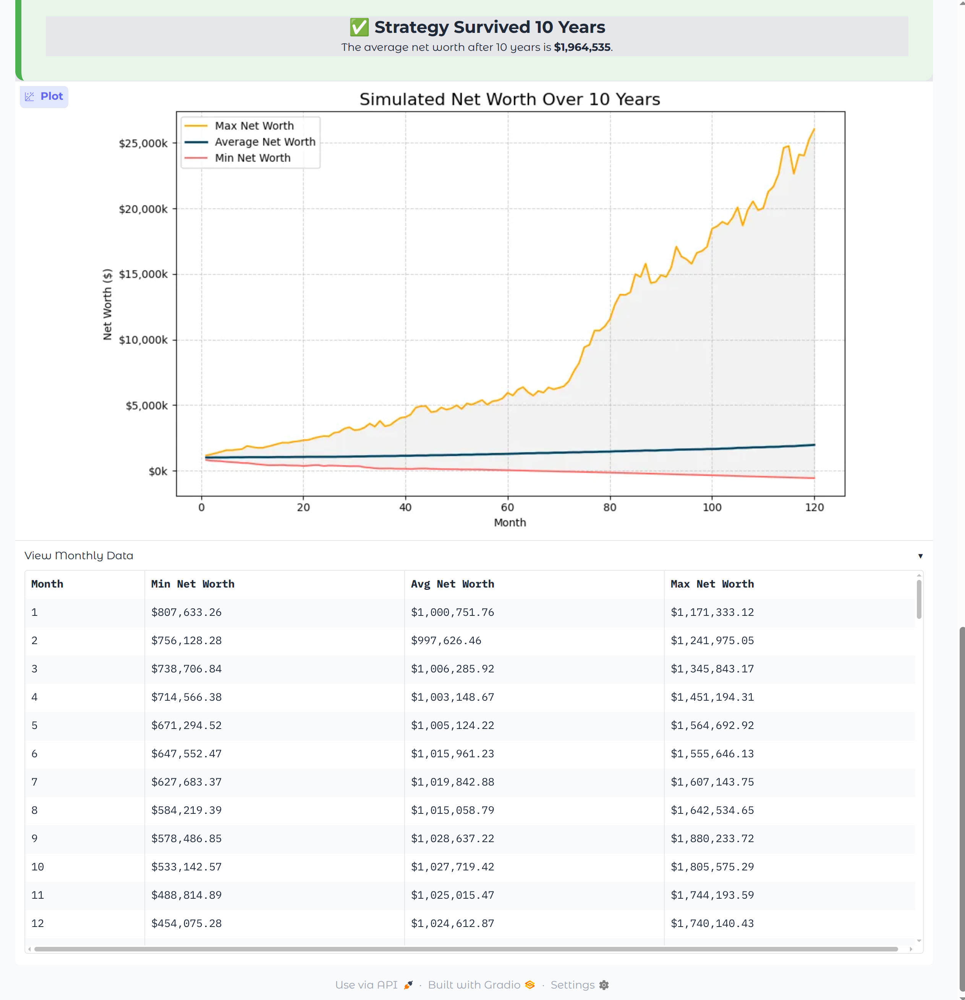

# Monte Carlo Retirement Simulation

This project is a Python-based Monte Carlo simulation model to assess the viability of a specific retirement plan over a 10-year period.

## Project Overview

The simulation models a retirement strategy where an individual with a $1M stock portfolio plans to live by borrowing on margin against it, rather than selling shares for income. The model runs thousands of scenarios over a 10-year period to assess the viability of this approach.

Each simulation month includes several key financial events:
- **Portfolio Growth:** The portfolio's value changes based on a randomized monthly return. The model can generate these returns using a **Normal**, **Student's t**, or **Laplace** distribution to better simulate real-world market behavior.
It's important to note that the simulation models each month's return as an independent event, drawing from the specified statistical distribution. This approach, often referred to as a 'random walk,' is a widely accepted simplification in financial modeling, reflecting the market's inherent unpredictability. While real markets can exhibit short-term dependencies like momentum or volatility clustering, this simulation focuses on long-term risk assessment using independent monthly returns.
- **Dividend Payouts:** Every quarter, dividends are paid out and used to reduce the margin loan balance.
- **Expense Funding:** Monthly living expenses are covered first by any passive income, with the remainder funded by increasing the margin loan.
- **Margin Interest:** Interest accrues monthly on the margin loan balance based on a randomized annual rate, which can also be modeled using one of the three statistical distributions.
- **Risk Management:** If the margin loan exceeds a specified percentage of the portfolio's value, a forced sale of assets occurs to bring the loan back to the limit.

At the end of each year, the model executes a tax strategy involving:
- **Tax-Gain Harvesting:** Selling and immediately repurchasing assets to realize long-term capital gains up to the federal tax-free limit, thereby "stepping up" the cost basis.
- **State Tax Calculation:** Calculating and paying California state taxes on net investment income, with the tax bill being added to the margin loan.

The final output shows the monthly range of potential net worth (maximum, average, and minimum) across all simulated scenarios, helping to quantify the risk and potential success of this strategy.

## Important Updates

### Volatility Drag Correction Implemented

A critical mathematical correction has been applied to the core simulation logic (`simulation.py`) to address the phenomenon of **volatility drag**.

**What is Volatility Drag?**
In financial simulations where returns are compounded over time and have variability (standard deviation), the arithmetic mean of the returns (the simple average) will be higher than the geometric mean (the actual compounded growth rate). If the simulation uses the arithmetic mean as its target for the random return generator, the *realized median (typical)* outcome of the simulation will consistently underperform the user's expected annual return.

**The Fix:**
The simulation now explicitly adjusts the monthly mean return used in its random number generation. This adjustment ensures that the **median** outcome of the Monte Carlo simulations accurately reflects the `Avg. Annual Return` specified by the user, providing a more reliable and intuitive result. This correction aligns the simulation with best practices in financial modeling for volatile assets.

**Impact:**
This fix provides more accurate and intuitive results. Users can now be confident that when they input an `Avg. Annual Return`, the typical (median) path of their portfolio in the simulation will closely match that expectation, even with significant volatility.

## Advanced Feature: Distribution Models for Risk

While standard financial models often use a Normal distribution ("bell curve") to predict returns, real-world markets don't always follow this pattern. Markets can experience extreme events (crashes or rallies) more frequently than a Normal distribution would suggest. This phenomenon is known as "fat tails" or leptokurtosis.

To create a more realistic simulation, this model includes two alternative distributions:

-   **Student's t-Distribution:** This model has "fatter tails" and is controlled by a **Degrees of Freedom (df)** parameter. A lower `df` value increases the probability of extreme market swings, allowing you to stress-test your strategy against more volatile scenarios.
-   **Laplace Distribution:** Another distribution with fatter tails than the Normal distribution, providing a different model for sharp market movements.

By choosing these alternative distributions in the "Advanced Settings" of the web UI, you can get a more robust understanding of the potential risks in your retirement strategy.

## Advanced Feature: Margin Investing

This simulation allows for an optional "Margin Investing" strategy, where the system automatically borrows on margin to invest when there is available capacity, maintaining a user-defined buffer below the maximum margin limit. This can potentially amplify returns but also increases risk.


### Visual Comparison of Distributions

The images below show the advance simulation setting. 


The images below show the simulation results using the three different distribution models. Notice how the "Min Net Worth" (the red line) dips lower in the Student's t and Laplace simulations, reflecting the higher probability of extreme negative returns.

| Normal Distribution | Student's t-Distribution (df=5) | Laplace Distribution |
| :---: | :---: | :---: |
|  |  |  |

## Getting Started

### Prerequisites

- Python 3.x
- pip

### Installation

1.  Clone the repository:
    ```bash
    git clone https://github.com/your-username/Retirement-Sim.git
    ```
2.  Navigate to the project directory:
    ```bash
    cd Retirement-Sim
    ```
3.  Install the required dependencies:
    ```bash
    pip install -r requirements.txt
    ```

## How to Run the Simulation

This project offers two ways to run the simulation:

### 1. Interactive Web Interface (Recommended)

For an interactive experience where you can easily change the input parameters and visualize the results, use the Gradio web application.

To start the web interface, run the following command:
```bash
python3 app.py
```
This will launch a local web server. Open the URL displayed in your terminal (e.g., `http://127.0.0.1:7860`) in your browser to access the application.

### 2. Command-Line Simulation

To run the simulation directly from the command line with the default parameters, execute:
```bash
python3 simulation.py
```
The script will output a results table to the console and display a plot visualizing the simulation outcomes.

### 3. Mobile App (Android/iOS)

A mobile-compatible version of the app has been built using the Kivy framework. You can run it on your desktop or package it for mobile devices.

**To run the app on your desktop:**
```bash
python mobile_app.py
```

**To package for Android/iOS (Advanced):**

You can turn the Kivy app into an Android `.apk` or `.aab` file, or an iOS XCode project, using a tool called **Buildozer**. This is an advanced process that requires installing additional dependencies like the Android NDK and SDK.

1.  **Install Buildozer:**
    ```bash
    pip install buildozer
    ```
2.  **Create a `buildozer.spec` file:**
    ```bash
    buildozer init
    ```
3.  **Edit the `buildozer.spec` file:** You will need to configure the `requirements` line to include `python3,kivy,matplotlib,numpy,pandas`.
4.  **Run Buildozer:**
    ```bash
    # For Android
    buildozer android debug deploy run
    
    # For iOS (requires macOS)
    buildozer ios debug
    ```
For detailed instructions, please refer to the official [Buildozer documentation](https://buildozer.readthedocs.io/en/latest/).


## Customizing the Simulation

-   **Via the Web Interface**: The easiest way to customize the simulation is by running `app.py` and modifying the inputs directly in your browser. This includes basic financial parameters as well as advanced settings for the underlying statistical distribution models (Normal, Student's t, Laplace).
-   **Via the Command-Line**: If you are using `simulation.py`, you can customize the run by modifying the `inputs` dictionary within the `main()` function of the script.

### Simulation Parameters

Here is a comprehensive list of all configurable parameters for the simulation:

*   **Initial Portfolio Value ($)**: The starting value of your investment portfolio.
*   **Initial Cost Basis ($)**: The original value of your assets for tax purposes.
*   **Annual Spending ($)**: The total amount of money you plan to spend annually.
*   **Monthly Passive Income ($)**: Your monthly income from sources other than the portfolio.
*   **Quarterly Dividend Yield (%)**: The quarterly dividend yield of your portfolio.
*   **Federal Tax-Free Gain Limit ($)**: The annual limit for tax-free capital gains.
*   **Avg. Annual Return (%)**: The expected average annual return of your portfolio.
*   **Annual Std. Dev. (%)**: The annualized standard deviation of your portfolio's returns (volatility).
*   **Avg. Margin Rate (%)**: The average annual interest rate on your margin loan.
*   **Margin Rate Std. Dev. (%)**: The standard deviation of the margin loan interest rate.
*   **Margin Borrow Limit (%)**: The maximum percentage of your portfolio you are willing to borrow on margin.
*   **# of Simulations**: The number of different market scenarios to simulate.
*   **Tax Harvest Profit Threshold (%)**: The unrealized profit percentage that triggers tax-gain harvesting.
*   **Portfolio Return Distribution**: Choose the probability distribution for generating random market returns (options: Normal, Student's t, Laplace).
*   **Degrees of Freedom (for Student's t) (Return)**: Lower values create 'fatter tails' (more extreme events). Only used if Student's t is selected for portfolio returns.
*   **Margin Rate Distribution**: Choose the probability distribution for generating random margin interest rates (options: Normal, Student's t, Laplace).
*   **Degrees of Freedom (for Student's t) (Interest)**: Lower values create 'fatter tails'. Only used if Student's t is selected for margin interest rates.
*   **Enable Margin Investing**: If enabled, the simulation will automatically borrow from margin to invest when there's room, maintaining a buffer below the margin limit.
*   **Margin Investing Buffer (%)**: The percentage below the brokerage margin limit that the simulation will aim to maintain when investing. (e.g., 10% means it will borrow up to 10% less than the max limit).


## Project Files

-   `app.py`: A web-based, interactive UI for the simulation built with Gradio. (Recommended)
-   `simulation.py`: The core Python script for the Monte Carlo simulation. Can be run directly.
-   `requirements.txt`: A list of the Python packages required for the project.
-   `README.md`: This file.
-   `ref/project_idea.md`: The project plan and requirements specification.
-   `ref/info.html`: An HTML file with a UI for the simulation.

## Screenshot

Here is a screenshot of the interactive web interface:



Here is a screenshot of the Gemini analysis:


